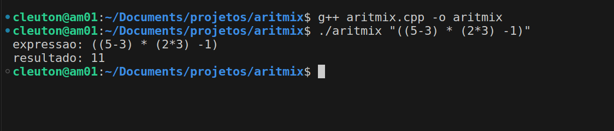

# Aritmix

Cleuton Sampaio

Aritmix é um programa simples em C++ que analisa uma expressão **infixa**, transforma em **posfixa**, com o uso de uma pilha, e depois a resolve.

É uma demosntração de **análise** de expressões. 

Operadores aritmeticos:
- "+" -> Soma
- "-" -> Subtração
- "*" -> Multiplição
- ":" -> Divisão
- "^" -> Exponenciação

Aceita parentesis

 Casos de teste (já calculados):
 ```
 1+2 = 3
 1--3 = ERRO!
 ((5-3) * (2*3) -1) = 11
 1:(5^(3-2)+1) = 0,166666667
 4^(1:2) = 2
 ((1 + 2) * (6/2)) = ERRO!
 (1+2)^((4-2) * (1+2)) = 729
 -3 *(-2*5)^2 = -300
```

 Uso: aritmix [opcoes]
 Exemplo: ```aritmix (1+2)^((4-2) * (1+2))```

 > Este é um código **naive** criado para ser bem simples e ajudar estudantes de graduação a compreenderem estruturas de dados como **pilhas** e técnicas como análise de expressões. Não foi criado para performance ou elegância.

 ## Como compilar

Se você utiliza **linux** é bem simples: 
```
g++ aritmix.cpp -o aritmix
```

E para executar: 
```
./aritmix "((5-3) * (2*3) -1)"
```



 Outras plataformas, como **MacOS** ou **MS Windows** são ligeiramente diferentes. 

 ## MacOS

 Para compilar um programa C++ no macOS, você pode utilizar o compilador `clang++`, que é instalado por padrão com o Xcode Command Line Tools. Siga os passos abaixo para compilar e executar seu programa:

1. **Instalar o Xcode Command Line Tools (se ainda não estiver instalado):**
   Abra o Terminal e digite:
   ```bash
   xcode-select --install
   ```
   Isso instalará o `clang++` junto com outras ferramentas de linha de comando necessárias.

2. **Salvar o código do programa em um arquivo:**
   Abra um editor de texto, copie e cole seu código-fonte C++ e salve o arquivo com uma extensão `.cpp`, por exemplo, `aritmix.cpp`.

3. **Compilar o programa:**
   No Terminal, navegue até o diretório onde o arquivo `aritmix.cpp` está salvo e execute o comando:
   ```bash
   clang++ -o aritmix aritmix.cpp -std=c++11
   ```
   Este comando compila o arquivo `aritmix.cpp` e cria um executável chamado `aritmix`. A opção `-std=c++11` é usada para especificar o uso do padrão C++11, que pode ser necessário dependendo das características do C++ que seu código utiliza.

4. **Executar o programa compilado:**
   Ainda no Terminal, você pode executar o programa com:
   ```bash
   ./aritmix
   ```
   Se o seu programa requer argumentos de linha de comando (como parece ser o caso), você pode fornecê-los diretamente na execução:
   ```bash
   ./aritmix "sua expressão aritmética"
   ```

Esses passos devem permitir que você compile e execute programas C++ no seu macOS sem problemas.

## MS Windows

Para compilar e executar um programa C++ no Windows usando a linha de comando, você pode usar o compilador da Microsoft, o MSVC (Microsoft Visual C++), que faz parte do Visual Studio, ou usar o MinGW, que é uma versão do GCC para Windows. Aqui vou te guiar pelos passos usando o MinGW, pois é uma opção gratuita e fácil de instalar.

### Usando MinGW

1. **Instalar o MinGW:**
   - Faça o download do instalador do MinGW [aqui](https://sourceforge.net/projects/mingw/).
   - Execute o instalador e selecione os pacotes básicos para instalação, incluindo `mingw32-base`, `mingw32-gcc-g++`, e qualquer outro pacote que você considere necessário.
   - Siga as instruções para concluir a instalação.

2. **Adicionar o MinGW ao PATH do sistema:**
   - Depois de instalar o MinGW, você precisa adicionar o diretório `bin` à variável de ambiente PATH. Normalmente, este diretório é `C:\MinGW\bin`.
   - No menu Iniciar, procure por "variáveis de ambiente" e selecione "Editar as variáveis de ambiente do sistema" ou "Editar variáveis de ambiente".
   - Na janela "Propriedades do Sistema", clique em "Variáveis de Ambiente".
   - Localize a variável "Path" em "Variáveis do sistema", selecione-a e clique em "Editar".
   - Clique em "Novo" e adicione o caminho para o diretório `bin` do MinGW, e clique em "OK" em todas as janelas para salvar as alterações.

3. **Salvar o seu código C++ em um arquivo:**
   - Abra um editor de texto, como o Notepad, e copie e cole seu código C++.
   - Salve o arquivo com uma extensão `.cpp`, por exemplo, `aritmix.cpp`.

4. **Compilar o programa:**
   - Abra o Prompt de Comando (cmd) e navegue até o diretório onde você salvou `aritmix.cpp`.
   - Digite o seguinte comando para compilar seu programa:
     ```bash
     g++ -o aritmix aritmix.cpp -std=c++11
     ```
   - Este comando usa o compilador g++ para compilar `aritmix.cpp`, gerando o executável `aritmix.exe`.

5. **Executar o programa compilado:**
   - Ainda no Prompt de Comando, você pode executar seu programa com:
     ```bash
     aritmix
     ```
   - Se precisar passar argumentos de linha de comando, inclua-os após o nome do programa:
     ```bash
     aritmix "sua expressão aritmética"
     ```

Essas etapas devem ajudá-lo a configurar um ambiente de desenvolvimento C++ funcional no Windows usando o MinGW.